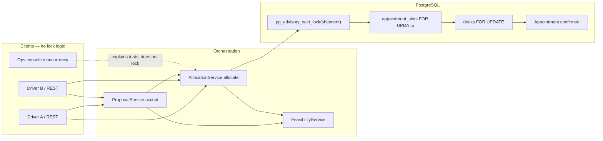
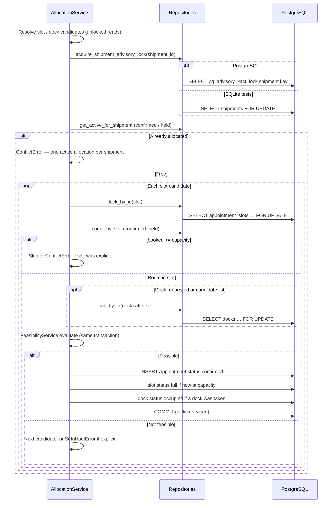
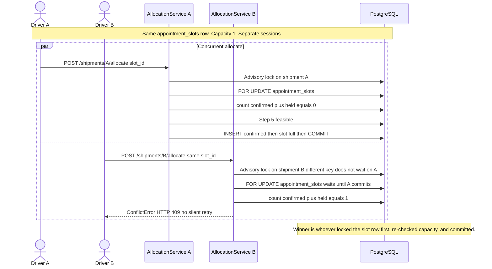
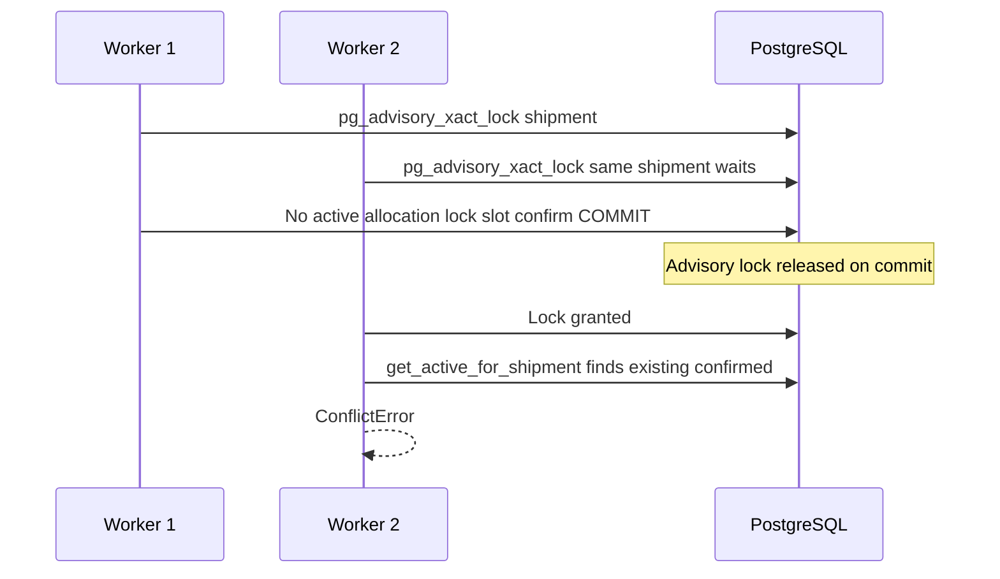
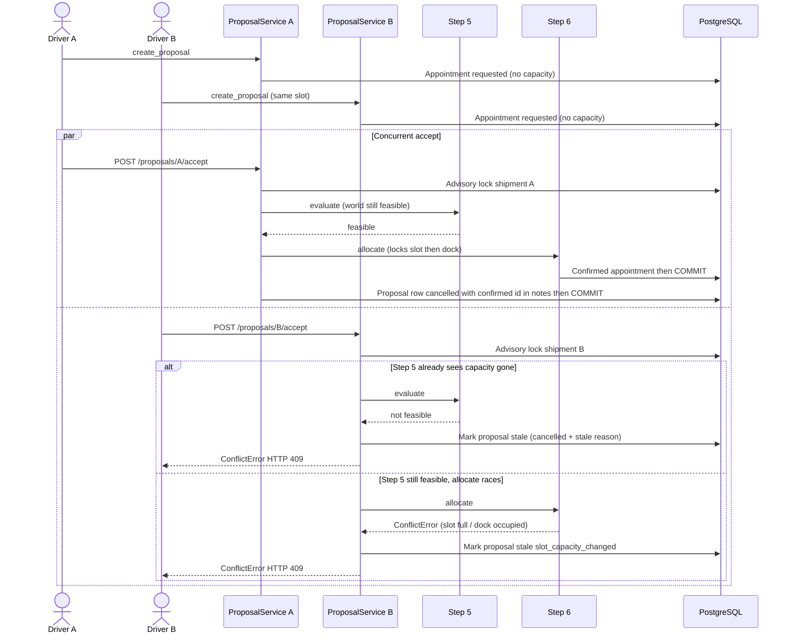

# Concurrency locking sequence

How SetuHaul prevents double-booking when two clients confirm the same scarce slot or dock. This is what is implemented in Step 6 (`AllocationService`) and the Step 7 accept wrapper (`ProposalService.accept`). Companion to [architecture.md](architecture.md), [Show_Propose_Confirm_Sequence.md](Show_Propose_Confirm_Sequence.md), and [Driver_conversation_sequence.md](Driver_conversation_sequence.md).

Rendered overview of lock order, the capacity-1 race, and Step 7 wrapping Step 6: [Concurrency_locking_sequence.png](Concurrency_locking_sequence.png).

**Rule.** Showing an option and writing `Appointment` `status=requested` do not consume capacity. Only Step 6, holding locks in one transaction, may write `confirmed` / `held`. Step 7 does not invent a second lock scheme; it takes the shipment advisory lock, revalidates with Step 5, then calls Step 6.

## What is implemented

| Piece | Location | Role |
|---|---|---|
| Lock order | `ALLOCATION_LOCK_ORDER` in `allocation.py` | `shipment` → `slot` → `dock` (deadlock prevention) |
| Shipment guard | `AppointmentRepository.acquire_shipment_advisory_lock` | PostgreSQL `pg_advisory_xact_lock`; SQLite `SELECT … FOR UPDATE` on `shipments` |
| Slot lock | `AppointmentSlotRepository.lock_by_id` | `SELECT appointment_slots … FOR UPDATE` |
| Dock lock | `DockRepository.lock_by_id` | `SELECT docks … FOR UPDATE` after the slot row is locked |
| Capacity | `count_by_slot` vs `slot.capacity` | Count only `confirmed` and `held` (`CAPACITY_CONSUMING_APPOINTMENT_STATUSES`) |
| Feasibility inside lock | `FeasibilityService.evaluate` | Step 6 cannot bypass Step 5 |
| Commit | `safe_commit` in `allocate()` | Row locks and the advisory lock release on commit / rollback |
| Step 7 wrap | `ProposalService.accept` | Same shipment advisory lock, then revalidate, then `AllocationService.allocate` |
| REST | `POST /shipments/{id}/allocate`, `POST /proposals/{id}/accept` | Structured clients share the services |
| Conversation | `accept_proposal` tool | Same `ProposalService`; LLM does not take locks |
| Console | `/concurrency` (`ConcurrencyPage.tsx`) | Explains the race; does not fire two live confirms |
| Evidence | `tests/test_step6_concurrency.py`, `tests/test_step7_concurrency.py` | Real PostgreSQL, thread pool, no silent retry |

Proposals reuse frozen `Appointment` rows (`requested` + `STEP7_PROPOSAL`). Capacity is not consumed until a **separate** `confirmed` allocation row exists. There is no `expires_at` column and no extra lock table.

## Participants

## Lock order (every allocate)

`ALLOCATION_LOCK_ORDER = ("shipment", "slot", "dock")`. Slot is always locked before dock (`_lock_dock_after_slot`). Candidates are resolved **before** locks so the transaction does not hold locks while listing open slots.

On any exception, `allocate()` rolls back the session, so neither the appointment nor slot/dock status changes.

## Hero race — slot capacity 1, two shipments

Classroom case on `/concurrency` and `test_capacity_one_two_concurrent`: two feasible shipments, one open slot with `capacity=1`, two threads calling `AllocationService.allocate` at once. Exactly one `success`, one `ConflictError`. Confirmed rows for that slot stay at 1.

The shipment advisory lock does **not** serialize two different shipments. Serialization of the scarce resource is the slot (and dock) `FOR UPDATE`. The advisory lock serializes two allocates for the **same** shipment.

## Same shipment, two concurrent allocates

`test_same_shipment_two_concurrent`: capacity 5 so the slot is not the bottleneck. Both workers use the same `shipment_id`. The second waits on `pg_advisory_xact_lock`, then sees an active confirmed/held appointment and raises `ConflictError`. One confirmed row.

## Same dock, two concurrent allocates

`test_same_dock_two_concurrent`: slot capacity 5, one dock. Both request that `dock_id`. Order is still shipment → slot → dock. After the winner commits, `dock.status` is `occupied`. The waiter’s `lock_by_id(dock)` then fails the availability check → `ConflictError`.

## Capacity N, N+1 concurrent

`test_capacity_two_three_concurrent` (Step 6) and `test_no_double_booking_under_concurrency` (Step 7): slot `capacity=2`, three concurrent confirms. Two succeed, one conflicts. Booked count equals capacity. When booked reaches capacity, Step 6 sets `AppointmentSlot.status = full`.

Rollback is not sticky: `test_rollback_during_contention_allows_next` confirms a later shipment on a **new** open slot after a conflict.

## Step 7 accept wraps Step 6 (no second lock scheme)

Conversation `accept_proposal` and `POST /proposals/{id}/accept` share this path. Step 7 acquires the shipment advisory lock, re-reads the proposal, re-runs Step 5 **before** calling allocate, then delegates slot/dock locking to Step 6.

`requested` proposals are not in `CAPACITY_CONSUMING_APPOINTMENT_STATUSES`, so two drivers can both hold `requested` rows on the same slot. Only accept consumes capacity.

`test_two_proposals_same_slot_one_succeeds`: one `confirmed`, one `conflict`, confirmed count on the slot is 1.

`test_same_proposal_accepted_concurrently`: both workers may return `confirmed` **only** if they point at the **same** allocation id (idempotent retry / matching-allocation recovery). Confirmed count stays 1.

### Two-commit recovery

Step 6 `allocate()` calls `safe_commit` on the shared session, which releases the transaction-scoped advisory lock and row locks. Step 7 then marks the proposal row `cancelled` with the confirmed appointment id in `notes`, and commits again.

If that second commit fails, a retry of accept finds the matching `confirmed`/`held` allocation for the same shipment + slot (+ dock if set) via `_try_reconcile_confirmed` / `_find_matching_confirmed_allocation` and repairs proposal notes without inserting a second booking.

Expired proposals (30 minutes from `created_at`, application TTL) and rejected / stale proposals cannot be accepted.

## What the frontend does not do

`ConcurrencyPage` draws the capacity-1 picture and points at the pytest files. It does not take locks, pick a winner, or expose a classroom endpoint that fires two live confirms against shared demo data. A 409 on a second driver is a backend outcome.

## Tests vs behavior (as coded)

| Test | What it proves |
|---|---|
| `test_capacity_one_two_concurrent` | Two shipments, capacity 1 → 1 success, 1 conflict, 1 booked |
| `test_capacity_two_three_concurrent` | Capacity 2, three workers → 2 success, 1 conflict |
| `test_same_shipment_two_concurrent` | Advisory lock: one active allocation per shipment |
| `test_same_dock_two_concurrent` | Dock `FOR UPDATE` + occupied check |
| `test_rollback_during_contention_allows_next` | Failed allocate does not poison a later slot |
| `test_two_proposals_same_slot_one_succeeds` | Two `requested` holds; one accept wins |
| `test_same_proposal_accepted_concurrently` | Same proposal id: at most one booking; retry may return the same id |
| `test_no_double_booking_under_concurrency` | Three accepts, capacity 2 → two confirmed |

Workers set `lock_timeout = '10s'` so a stuck lock fails the test instead of hanging.

## What this sequence does not do

Optimistic version columns, `SELECT … SKIP LOCKED`, Redis / advisory locks on slots, a dedicated lock table, silent retry/backoff in the API, frontend-simulated locking, and driver authentication of who is accepting are out of scope as built. `ShipmentRepository.lock_by_id` exists but allocation uses the advisory (or SQLite shipment `FOR UPDATE`) path, not that helper.

Step 9 ranking never takes these locks and never writes appointments.
