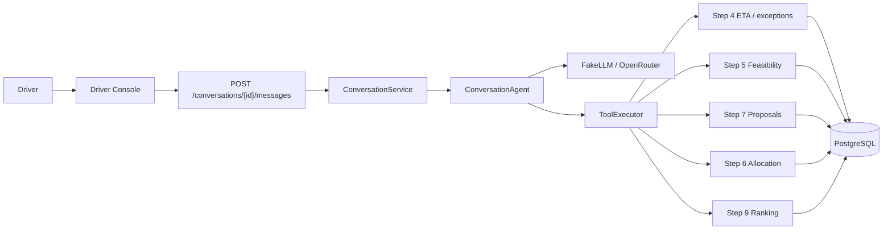

# Driver conversation sequence

How a driver message becomes an operational outcome in SetuHaul, as implemented through Steps 8 / 8H (conversation) and the engines it may call (Steps 4–7, optional Step 9). Companion to [architecture.md](architecture.md) and [ai_responsibility_boundary.md](ai_responsibility_boundary.md).

Rendered overview of the hero path and one-turn internals: [driver_conversation_sequence.png](driver_conversation_sequence.png). Show vs propose vs confirm (Step 7 lifecycle): [Show_Propose_Confirm_Sequence.md](Show_Propose_Confirm_Sequence.md).

**Rule.** Showing an option, proposing it, and confirming it are three different turns. The LLM parses language and explains `rule_results`. It does not decide feasibility or consume capacity.

## What is implemented

| Piece | Location | Role |
|---|---|---|
| Driver Console | `frontend/src/pages/DriverConsolePage.tsx` | Free-text UI. Displays API results only. |
| HTTP | `POST /conversations`, `POST /conversations/{id}/messages` | Create thread; one inbound message per request |
| Orchestration | `ConversationService` | Persist `ChatThread` / `ChatMessage`; load context; call agent |
| Language | `ConversationAgent` + FakeLLM or OpenRouter | Intent, entities, clocks, clarification |
| Tools | `ToolExecutor` + `ToolName` | Closed allowlist; unknown names → `forbidden` |
| Authority | Steps 4–7 services / engines | ETA, exceptions, feasibility, proposals, allocation |
| Optional rank | Step 9 `evaluate_facility_schedule` | Read-only; does not book |
| Persistence | Frozen `ChatThread` / `ChatMessage` | Ops context in `ChatMessage.metadata` JSON |

No LangChain / LangGraph. No driver authentication. Escalation is a flag, not a dispatcher.

## Participants



## One turn (every driver message)

Every `POST /conversations/{thread_id}/messages` follows this path. Tools run only after shipment / option / delay facts are sufficient.

```mermaid
sequenceDiagram
  actor Driver
  participant UI as Driver Console
  participant API as Conversation API
  participant CS as ConversationService
  participant AG as ConversationAgent
  participant LLM as FakeLLM / OpenRouter
  participant EX as ToolExecutor
  participant Eng as Steps 4–7 / 9
  participant DB as PostgreSQL

  Driver->>UI: Free text
  UI->>API: POST /conversations/{id}/messages
  API->>CS: handle_message
  CS->>DB: ChatMessage inbound (DRIVER)
  CS->>CS: Reconstruct ConversationContext from metadata
  CS->>AG: handle(message, context)
  AG->>LLM: understand(message)
  Note over LLM: Intent and entities only.<br/>confirm / reject come from driver text, not model JSON.
  LLM-->>AG: Understanding
  AG->>AG: resolve_shipment (never guess)
  AG->>AG: Store leave-by / earliest-start clocks

  alt Missing shipment, option, or delay
    AG-->>CS: Clarification turn, no tools
  else injection_attempt
    Note over AG: Skip IRREVERSIBLE_TOOLS
    AG->>EX: Read-only tools only (if any)
  else Planned tools
    AG->>EX: Allowlisted ToolName + closed arguments
    EX->>Eng: Existing services (not SQL, not arbitrary functions)
    Eng->>DB: Read or write per tool
    Eng-->>EX: Result / ConflictError / stale
    EX-->>AG: ToolResult
    AG->>AG: Apply result to context; maybe escalate
  end

  AG->>AG: formatter.py wording from tool results
  AG-->>CS: AgentTurn
  CS->>DB: ChatMessage outbound + context snapshot
  CS-->>UI: ConversationMessageResponse
  UI-->>Driver: Assistant text (options / proposal / status)
```

### Guards on this turn

| Guard | Where | Effect |
|---|---|---|
| Closed `ToolName` | `tools.py`, `executor.py` | Unknown name → `error_code=forbidden` |
| Injection skips writes | `intents.py` markers + `IRREVERSIBLE_TOOLS` | Prompt-injection cannot book |
| `confirm` / `reject` from driver text | `provider.py` `_merge_provider_payload` | Model JSON cannot force accept |
| Never guess shipment | `context.py` `resolve_shipment` | Ambiguous hint → clarification |
| Leave-by / earliest-start | `clocks.py` | Slot that misses the clock is not proposed |
| OpenRouter failure | `OpenRouterProvider` | Falls back to FakeLLM parse |

## Hero conversation (what we have done so far)

This is the classroom path used by Demo Scenarios and `scripts/e2e_hero_flow.py` against seeded shipment **SH-1024**. Thread creation is a separate request.

```mermaid
sequenceDiagram
  actor Driver
  participant UI as Driver Console
  participant AG as ConversationAgent
  participant S4 as Step 4 ETA
  participant S5 as Step 5 Feasibility
  participant S7 as Step 7 Proposals
  participant S6 as Step 6 Allocation
  participant DB as PostgreSQL

  Driver->>UI: POST /conversations (driver_id, shipment_id)
  UI-->>Driver: thread_id (ChatThread)

  rect rgb(240, 248, 255)
    Note over Driver,DB: Turn 1 — delay / ETA (Step 4). Does not book.
    Driver->>AG: I'll be 2 hours late … reach around 8:30 PM
    AG->>S4: record_eta_update
    S4->>DB: Immutable ETAUpdate
    AG-->>Driver: ETA recorded. Showing is not booking.
  end

  rect rgb(245, 245, 245)
    Note over Driver,DB: Turn 2 — clock only. Stored on context, no write tools.
    Driver->>AG: I need to leave by 9:30 PM
    AG->>AG: leave_by_local stored on ConversationContext
    AG-->>Driver: Keep leave-by in mind. Find options that finish by then?
  end

  rect rgb(240, 255, 240)
    Note over Driver,DB: Turn 3 — ASK_OPTIONS. Showing is not proposing.
    Driver->>AG: My ETA is 8:30 PM. What options do I have?
    AG->>S5: get_available_options (leave-by / earliest-start filters)
    S5-->>AG: Ordered feasible slots + rule_results
    AG-->>Driver: Numbered options. Capacity not consumed.
  end

  rect rgb(255, 250, 240)
    Note over Driver,DB: Turn 4 — PROPOSE_CHANGE. Proposal is not confirmation.
    Driver->>AG: The second one works, but I need to leave by 9:30 PM
    AG->>AG: clocks.py — slot must end on or before leave-by
    alt Slot misses leave-by
      AG-->>Driver: Cannot propose that option. Ask for another number.
    else Slot fits
      AG->>S7: create_proposal
      S7->>DB: Appointment status=requested (STEP7_PROPOSAL)
      Note over S7: Capacity is not consumed.
      AG-->>Driver: Proposed. Awaiting confirmation.
    end
  end

  rect rgb(245, 245, 245)
    Note over Driver,DB: Turn 5 — ASK_STATUS. Read-only. Must not accept.
    Driver->>AG: Has it been confirmed?
    AG->>S7: get_proposal
    AG-->>Driver: Still proposed / awaiting confirmation
  end

  rect rgb(255, 240, 245)
    Note over Driver,DB: Turn 6 — ACCEPT_PROPOSAL. Only this turn may consume capacity.
    Driver->>AG: Confirm it.
    AG->>S7: accept_proposal
    S7->>S5: Revalidate
    alt World changed (capacity taken)
      S5-->>S7: not feasible
      S7-->>Driver: stale / conflict (HTTP 409 on REST; conversation status=stale)
    else Still feasible
      S7->>S6: Allocate under slot/dock row locks
      S6->>DB: Appointment confirmed
      AG-->>Driver: Confirmed
    end
  end
```

| Turn | Example driver text | Intent | Tool(s) | Operational effect |
|---|---|---|---|---|
| Create | — | — | `POST /conversations` | `ChatThread` row |
| 1 | “I'll be 2 hours late … 8:30 PM” | `UPDATE_ETA` / `REPORT_DELAY` | `record_eta_update` | Immutable ETA history. No booking. |
| 2 | “I need to leave by 9:30 PM” | `CLARIFICATION_REQUIRED` (clock stored) | none | `leave_by_local` on context |
| 3 | “What options do I have?” | `ASK_OPTIONS` | `get_available_options` | Step 5 evaluates. Options shown, not proposed. |
| 4 | “The second one works …” | `PROPOSE_CHANGE` | `create_proposal` | `Appointment` `requested`. Capacity not consumed. |
| 5 | “Has it been confirmed?” | `ASK_STATUS` | `get_proposal` | Read-only. Accept is not called. |
| 6 | “Confirm it.” | `ACCEPT_PROPOSAL` | `accept_proposal` | Revalidate → Step 6 locks → confirmed, or stale. |

If the driver confirms a numbered option before a proposal exists, `_plan_accept` may call `create_proposal` then `accept_proposal` in the same turn — still only after explicit confirm language, and still through Step 7 → 5 → 6.

## Other implemented branches

These are live paths, not future work.

### Clarification (no tools)

Intents in `_SHIPMENT_REQUIRED` need a resolved shipment. Delay without minutes/ETA asks “How late will you be?”. Propose/accept without a numbered option asks which option. Ambiguous shipment hints never pick one at random (`resolve_shipment`).

### Leave-by rejection

If the chosen option’s slot ends after `leave_by_local`, the agent does not call `create_proposal`. It lists compatible numbered options or offers to search again (`_leave_by_rejected_turn`).

### Prompt injection

Markers such as “ignore previous”, “bypass allocation”, “execute sql” set `injection_attempt`. Irreversible tools (`create_proposal`, `accept_proposal`, `reject_proposal`, `record_eta_update`, `create_driver_exception`) are skipped. The driver is told operational rules cannot be changed from that message.

### Human escalation

`request_human_escalation` sets a flag on the thread. Triggers: driver asks for a human; no feasible options; operational conflict on options; language outside authority (legal / insurance / safety override). The formatter states a person has **not** acted yet.

### Facility schedule (Step 9)

Intent `ASK_FACILITY_SCHEDULE` → `evaluate_facility_schedule`. Ranking is a snapshot. It is not a hold. Confirmation still uses accept → revalidate → allocate.

### Reject / cancel

`REJECT_PROPOSAL` / `CANCEL_REQUEST` → `reject_proposal` when `proposal_id` is on the thread. Terminal proposals cannot become confirmed.

### Stale / concurrent capacity

A second driver (or REST client) can take the same slot after the first proposal. Accept re-runs Step 5; if infeasible, the conversation returns `stale` / `conflict` instead of confirming. Step 6 uses slot/dock row locks so two concurrent accepts cannot double-book.

## Intent → tool map (as coded)

| Intent | Planned tool(s) | Clarifies instead when |
|---|---|---|
| `UPDATE_ETA` / `REPORT_DELAY` | `record_eta_update` | No delay minutes and no ETA |
| `REPORT_EXCEPTION` | `create_driver_exception` | Shipment unresolved |
| `ASK_STATUS` | `get_proposal` if proposal on thread, else `get_shipment_status` | Shipment unresolved |
| `ASK_OPTIONS` | `get_available_options` | Shipment unresolved |
| `ASK_FACILITY_SCHEDULE` | `evaluate_facility_schedule` | Shipment unresolved |
| `PROPOSE_CHANGE` | `create_proposal` (or `get_proposal` if same slot already proposed) | No presented option / leave-by miss |
| `ACCEPT_PROPOSAL` | `create_proposal` if needed, then `accept_proposal` | No option selected; `confirm` false stops after propose |
| `REJECT_PROPOSAL` / `CANCEL_REQUEST` | `reject_proposal` | No active proposal |
| `HUMAN_ESCALATION` | `request_human_escalation` | — |
| `CLARIFICATION_REQUIRED` | none | Always a question |

`evaluate_feasibility` is allowlisted for a specific slot/dock check; the hero path uses `get_available_options` (open slots + Step 5).

## Persistence across turns

Operational context is not a new table. `ConversationService` rebuilds `ConversationContext` from outbound `ChatMessage.metadata` (`context.py`). That snapshot includes `shipment_id`, `presented_options`, `selected_option_index`, `proposal_id`, clocks, and escalation flags.

## What this sequence does not do

Driver login, national routing, travel-time prediction, hours-of-service calendars, LangChain, `POST /schedule/confirm`, human-task SLA, and a notifications inbox are out of scope as built.

Structured REST equivalent of the same authority path: `POST /shipments/{id}/proposals` then `POST /proposals/{id}/accept`. Conversation tools call those services; they do not replace them.
