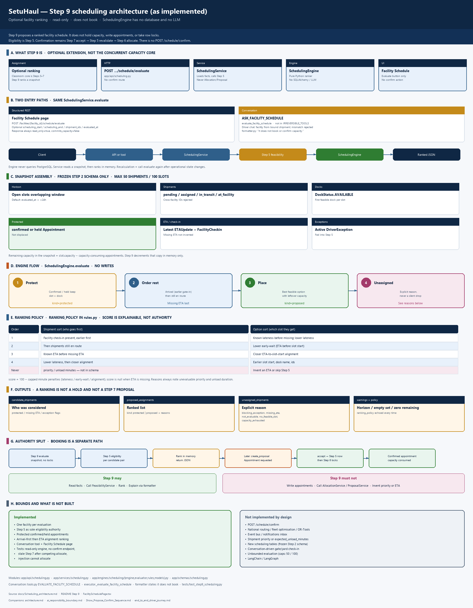
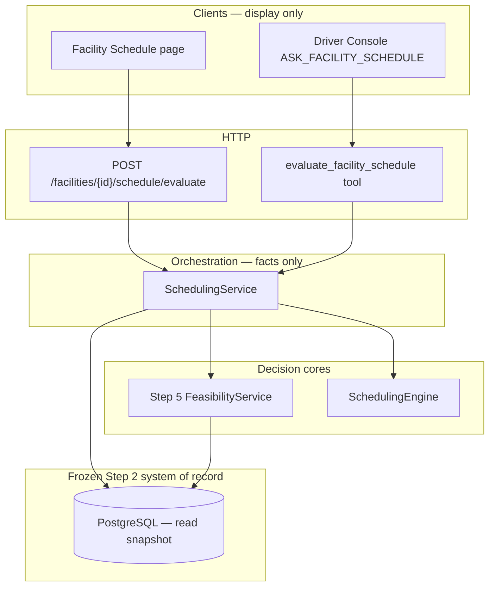
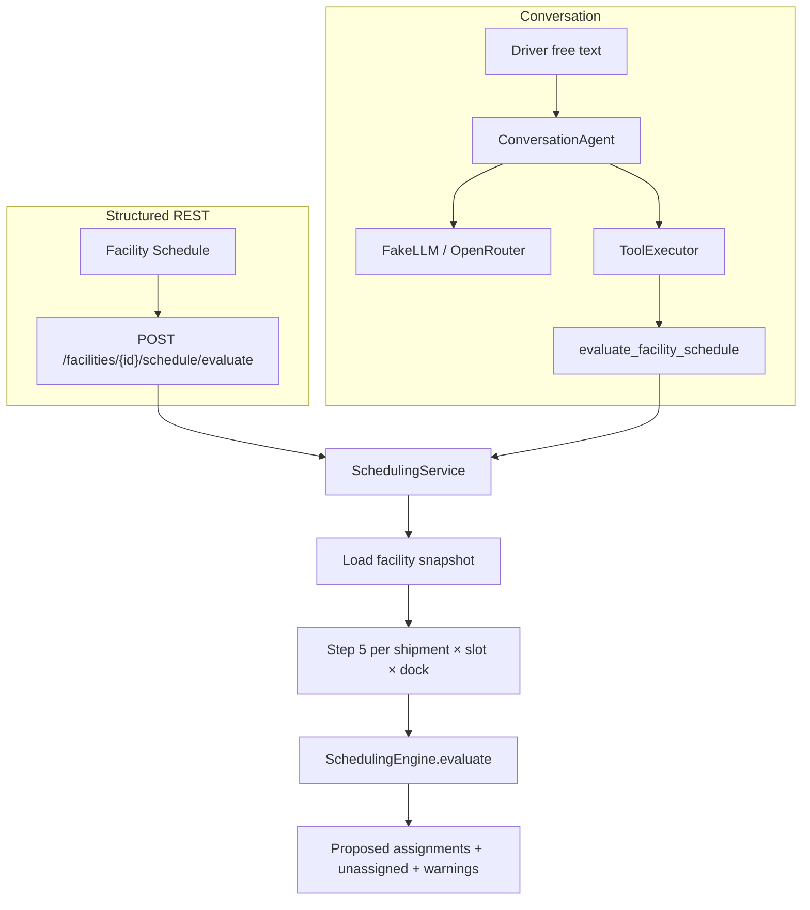
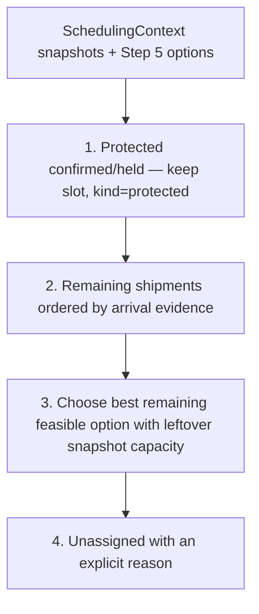
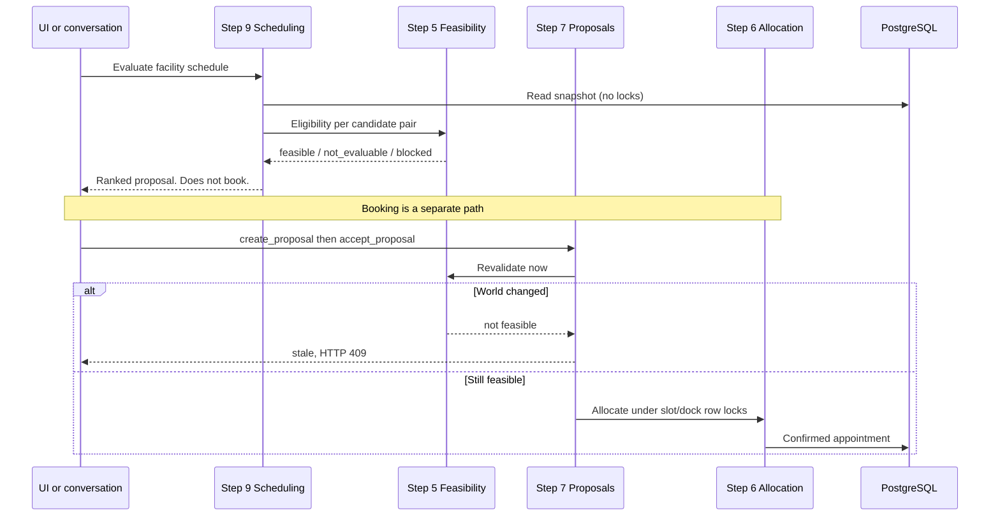

# Step 9 scheduling architecture

How SetuHaul ranks several inbound trucks against one facility snapshot. This is what is implemented in Step 9 — not a future optimiser. Companion to [architecture.md](architecture.md), [ai_responsibility_boundary.md](ai_responsibility_boundary.md), and [Show_Propose_Confirm_Sequence.md](Show_Propose_Confirm_Sequence.md).

Rendered overview: [Scheduling_architecture.png](Scheduling_architecture.png).

**Rule.** Step 9 generates a **proposed schedule**. It does not hold capacity, write appointments, take row locks, or confirm a booking. Eligibility still comes from Step 5. Confirmation still goes through Step 7 accept → Step 5 revalidation → Step 6 allocation.

| | |
|---|---|
| Assignment role | Optional extension. Not required for the classroom concurrent-capacity problem |
| Engine | `SchedulingEngine` — pure ranking, no database, no LLM |
| Orchestration | `SchedulingService` loads a snapshot, calls Step 5, then the engine |
| HTTP | `POST /facilities/{facility_id}/schedule/evaluate` |
| Conversation | Allowlisted `evaluate_facility_schedule` (read-only, not irreversible) |
| UI | Facility Schedule page — Evaluate only; no confirm button |
| Output flags | `read_only=true`, `commits_capacity=false` |

## Why it exists

Steps 5–7 already solve scarce capacity under concurrency. Step 9 adds an explainable, facility-level ranking when several trucks compete for the same docks and slots. Recalculation is another evaluation after operational state changes. There is no `POST /schedule/confirm`.

## Layered stack

Clients and the conversation agent never rank trucks themselves. They call the same service. The engine never talks to PostgreSQL.

| Layer | Location | Role |
|---|---|---|
| UI | `frontend/src/pages/FacilitySchedulePage.tsx` | Calls evaluate. Shows ranking policy, assignments, unassigned. No confirm. |
| API | `app/api/scheduling.py` | Single POST evaluate endpoint. No confirm route. |
| Contracts | `app/schemas/scheduling.py` | Horizon, optional shipment set, `evaluated_at`. |
| Service | `app/services/scheduling.py` | Load snapshot, call Step 5 per candidate pair, map engine output. |
| Engine | `app/engines/scheduling/` | Deterministic ranker. No SQLAlchemy, allocation, or proposals. |
| Conversation | `executor.py` `_evaluate_facility_schedule` | Resolves facility from bound shipment; forces `read_only` / `commits_capacity=false`. |
| Formatter | `formatter.py` | Explains the ranking. States that it does not book. |

## Runtime request path

Two entry styles share `SchedulingService.evaluate`.

Driver-bound chat requires a shipment. The tool uses that shipment's destination facility and rejects a mismatched `facility_id`. Dispatch-style facility-only ranking is allowed only when no driver actor is bound.

## Snapshot the service loads

The engine never queries the database. `SchedulingService` builds frozen dataclasses, then ranks.

| Snapshot | Source | What is included |
|---|---|---|
| Horizon | Request, or `evaluated_at` → start + 24 hours | Open slots that overlap the window. Max **100** slots. |
| Shipments | Destination facility, or explicit `shipment_ids` | Active `pending` / `assigned` / `in_transit` / `at_facility`. Max **50**. Terminal and inactive skipped. Cross-facility IDs rejected. |
| Docks | Available docks at the facility | `DockStatus.AVAILABLE` only. |
| Protected holds | Confirmed or held appointments | Those shipments keep their slot/dock. They are not moved. |
| Arrival evidence | `FacilityCheckin` gate-in / yard / dock arrival | Earliest arrival timestamp per shipment. Used for first-arrived ranking. |
| Latest ETA | Latest `ETAUpdate` | Missing ETA is not fabricated. |
| Exceptions | Active driver exceptions | Fed into Step 5; blocking exceptions become unassigned. |

Remaining slot capacity in the snapshot is `capacity −` appointments in capacity-consuming statuses. Step 9 does not decrement that in the database.

## Step 5 is still eligibility

For each unprotected shipment and overlapping open slot, the service asks Step 5 for a dock that passes (first available dock that is feasible), otherwise evaluates the slot with no dock. Results are cached per `(shipment, slot, dock)`.

The scheduler does not copy feasibility rules. `feasible`, `outcome`, `blocking_reasons`, and `warnings` come from `FeasibilityService`. Ranking metrics that Step 5 does not own are computed only when a latest ETA exists:

| Metric | Meaning | If ETA is missing |
|---|---|---|
| `lateness_seconds` | Seconds ETA is after slot end (0 if not late) | `null` — not invented |
| `early_wait_seconds` | Seconds ETA is before slot start | `null` |
| `alignment_seconds` | Absolute seconds between ETA and slot start | `null` |
| `yard_wait_seconds` | Seconds from gate/yard/dock check-in to `evaluated_at` | `null` if no check-in |

Numeric `score` is 0–100 from those ETA metrics only (`100 −` capped minute penalties). `score` is `null` when ETA is missing.

## Engine ranking (what actually orders trucks)

`SchedulingEngine.evaluate` is pure Python over `SchedulingContext`. Policy string: `RANKING_POLICY` in `app/engines/scheduling/rules.py`.

**Shipment order (competing set):**

1. Arrived at facility first (`gate_in_at` present), earlier check-in before later.
2. Then shipments still en route.
3. Known ETA before missing ETA.
4. Lower lateness, then closer alignment, then shipment number / id.

**Option order (once a shipment is being placed):**

1. Known lateness before missing lateness; lower lateness.
2. Lower early-wait.
3. Closer ETA-to-slot-start alignment.
4. Earlier slot start, dock name, `shipment_id`, `slot_id`.

Shipment `priority` and `expected_unload_minutes` are **not evaluable** on the frozen schema and are never invented. Assignment reasons always say so for proposed (non-protected) rows.

Protected appointments consume no extra snapshot capacity in the competing loop; remaining capacity is decremented only when a competing shipment is assigned a proposed slot.

## Outputs

| Field | Meaning |
|---|---|
| `candidate_shipments` | Who was considered, including protected / missing ETA / exception flags |
| `proposed_assignments` | Ranked list. `kind=protected` or `kind=proposed`. Reasons are human-readable. |
| `unassigned_shipments` | Explicit reason, not a silent drop |
| `warnings` | Empty horizon, no eligible shipments, or slots already at zero remaining after protected holds |
| `ranking_policy` | The documented sort order, returned on every response |

**Unassigned reasons** (`UnassignedReason`):

| Reason | When |
|---|---|
| `blocking_exception` | Active driver exception blocked Step 5 |
| `missing_eta` | No latest ETA, so window alignment is not evaluable |
| `not_evaluable` | Step 5 could not fully evaluate any candidate slot |
| `no_feasible_slot` | Step 5 found no feasible slot/dock pair |
| `capacity_exhausted` | Feasible slots existed; snapshot capacity went to higher-ranked shipments |
| `ineligible` | Defined on the model; competing set is already filtered by the service |

A proposed assignment is **not** a Step 7 proposal and **not** a hold. Availability can change before accept.

## Relationship to Steps 5–8

| Step | Authority | What Step 9 may do |
|---|---|---|
| 5 | Slot / dock / hours / capacity eligibility | Call it. Never copy rules. |
| 6 | Consume scarce capacity under row locks | Never call. Engine and service contain no `AllocationService`. |
| 7 | Propose vs confirm | Never call. A stale schedule cannot confirm if capacity changed. |
| 8 | Language + allowlisted tools | May explain ranking. Tool is not in `IRREVERSIBLE_TOOLS`. Injection cannot turn ranking into allocate. |

Tests: `tests/test_step9_scheduling.py` (read-only engine, no confirm endpoint, Step 7 stale after a competing allocate, conversation tool boundary, prompt injection does not allocate).

## Explicitly out of scope (as built)

**Not implemented by design.** National routing, fleet optimisation, OR-Tools, event bus, `POST /schedule/confirm`, time-calendar dock occupancy beyond Step 5 slot/dock rules, notifications inbox.

**Schema-bound.** No shipment `priority` or `expected_unload_minutes`. The current assignment model does not fully model those operational attributes. No new scheduling tables. `FacilityCheckin` is ranking evidence, not a conversation check-in turn. Appointment slots currently represent facility-level windows rather than individual dock-level resources. Confirm-time allocation remains first-successful-confirm; Step 9 does not implement a fairness or priority booking policy.

**Bounds.** Evaluation may call Step 5 per shipment/slot/dock combination, capped at 50 shipments and 100 slots.
