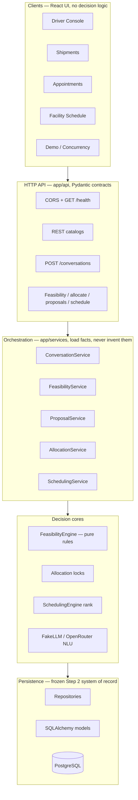
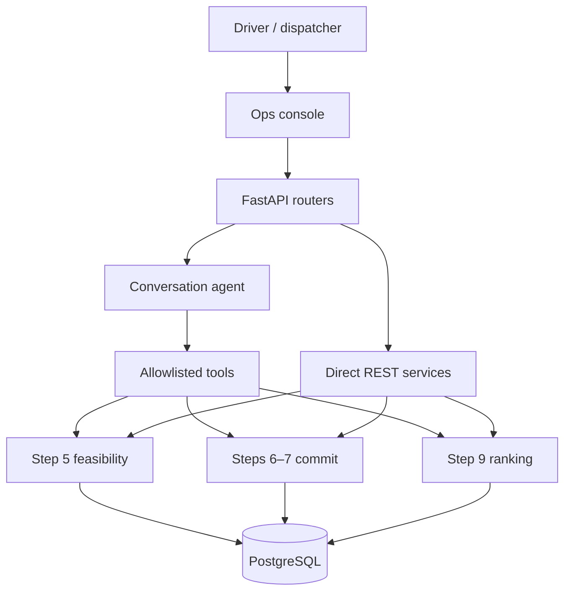
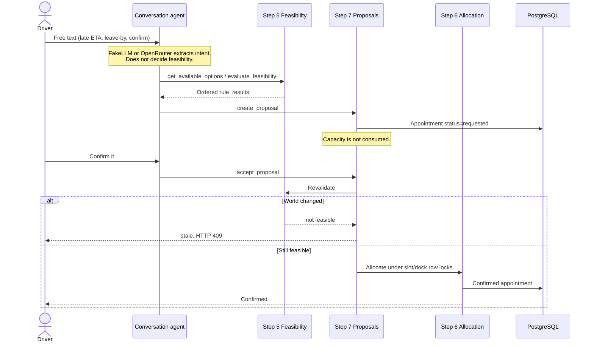

# SetuHaul system architecture

Assignment design for a deterministic warehouse appointment coordinator, mapped to what is implemented through Steps 1–9 plus the operations console.

Rendered overview: [system_architecture.png](system_architecture.png).

**Core design rule.** Operational decisions (slot feasibility, dock compatibility, capacity, allocation, and confirmation) are explicit Python rules. The conversational layer may parse driver text and explain outcomes. It cannot independently decide feasibility or commit a booking. LangChain and LangGraph are not used. AI vs engine split: [ai_responsibility_boundary.md](ai_responsibility_boundary.md). Driver conversation sequence (hero flow and one-turn internals): [Driver_conversation_sequence.md](Driver_conversation_sequence.md). Show vs propose vs confirm: [Show_Propose_Confirm_Sequence.md](Show_Propose_Confirm_Sequence.md). Concurrent capacity locks: [Concurrency_locking_sequence.md](Concurrency_locking_sequence.md). Proposal lifecycle states: [proposal_state_diagram.md](proposal_state_diagram.md). Step 9 ranking: [Scheduling_architecture.md](Scheduling_architecture.md). ETA and driver-exception writes (Step 4, no booking): [eta_exception_flow.md](eta_exception_flow.md).

| | |
|---|---|
| Assignment steps | 1–9 complete (including 2H, 6H, 8H) |
| LLM role | Language understanding and explanation only |
| Decision authority | Feasibility, allocation, proposals, optional ranking |
| Step 9 | Read-only facility ranking — does not book |

## Assignment problem

SetuHaul coordinates inbound shipments at constrained receiving facilities. A driver who is late, blocked, or asking for a new window must be offered options that respect operating hours, dock capacity, slot availability, vehicle compatibility, and existing appointments — without double-booking under concurrent requests.

**Required classroom problem.** Driver conversation plus concurrent scarce capacity. Feasibility (Step 5), allocation with locks (Step 6), and controlled proposals (Step 7) are the authority path. Step 8 is the driver-facing language layer over those services.

**Optional extension.** Step 9 ranks several trucks against one facility snapshot. It proposes a schedule and never writes appointments. Confirmation still goes through Step 7 accept → Step 5 revalidation → Step 6 allocation.

## Layered stack

Each band only talks to the band below it for writes. The UI never bypasses the API and does not calculate feasibility, capacity, dock compatibility, or confirmation.

| Layer | Location | Role |
|---|---|---|
| Clients | `frontend/` | Vite + React ops console. Displays API results only. |
| HTTP API | `app/api/` | FastAPI routers, CORS, health. |
| Conversation | `app/ai/conversation/` | Intent, entities, thread context, allowlisted tools, formatter. |
| Orchestration | `app/services/` | Load facts and call engines. |
| Decision cores | `app/engines/` | Pure feasibility and ranking. Allocation holds row locks. |
| Persistence | `app/models/`, `app/repositories/` | Frozen schema. Proposals reuse `Appointment` rows. ER: [er-diagram.md](er-diagram.md). |

Frontend routes: Driver Console, Shipments, Appointments, Facility Schedule, Demo Scenarios, Concurrency. Seeded demo shipment **SH-1024**.

API routers: carriers, drivers, vehicles, shipments, proposals, facilities, scheduling, appointments, operations, conversations.

## Runtime request path

Two entry styles share the same engines: free-text via the conversation agent, or structured REST from the console pages.

Step 5 and Steps 6–7 are the authorities that decide eligibility and consume capacity. Step 9 only reads.

## Confirmation path

There is no AI booking pathway. Showing an option, proposing it, and confirming it are three different states.

| Step | What happens |
|---|---|
| 1 | Driver free text is stored on `ChatThread`. |
| 2 | FakeLLM or OpenRouter extracts intent/entities. Clarification if facts are missing. |
| 3 | `get_available_options` / `evaluate_feasibility`. Step 5 emits ordered `rule_results`. |
| 4 | `create_proposal` writes `Appointment` `status=requested`. Capacity is not consumed. |
| 5 | `accept_proposal` re-runs Step 5. If the world changed: stale, HTTP 409. |
| 6 | Step 6 takes slot/dock row locks, re-checks capacity, writes a confirmed appointment. |

Proposal lifecycle: `proposed` → confirmed only through accept. Also: rejected, expired (30 minutes from `created_at`), or stale. Terminal states cannot become confirmed. A Step 9 ranking is never a hold.

Structured REST equivalent: `POST /shipments/{id}/proposals` then `POST /proposals/{id}/accept`. Conversation tools call the same services.

## Authority split

| Concern | Owner | May the LLM do this? |
|---|---|---|
| Parse driver text, clarify, explain | Step 8 agent + FakeLLM / OpenRouter | Yes — this is its job |
| Shipment / ETA / exception facts | Step 3–4 services | No — tools call services |
| Slot / dock / hours / capacity eligibility | Step 5 `FeasibilityEngine` | No |
| Commit scarce capacity | Step 6 `AllocationService` | No |
| Propose vs confirm a change | Step 7 `ProposalService` | Only via `accept_proposal` tool |
| Rank several trucks at a facility | Step 9 `SchedulingEngine` | No — read-only tool only |
| Human takeover | Escalation flag on `ChatThread` | May request; does not dispatch |

## Allowlisted conversation tools

The agent cannot run arbitrary functions or SQL. Irreversible tools still delegate to existing write services.

| Tool | Backend | Effect |
|---|---|---|
| `get_shipment_status` | `ShipmentService` + latest ETA | Read |
| `record_eta_update` | `ETAUpdateService` | Write (immutable history) |
| `create_driver_exception` | `DriverExceptionService` | Write |
| `evaluate_feasibility` | `FeasibilityService` | Read / evaluate |
| `get_available_options` | Open slots + Step 5 | Read / evaluate |
| `create_proposal` / `get_proposal` / `reject_proposal` | `ProposalService` | Write proposal row only |
| `accept_proposal` | Proposal → Feasibility → Allocation | Commit capacity |
| `request_human_escalation` | Message metadata + thread subject | Flag only |
| `evaluate_facility_schedule` | `SchedulingService` + engine | Read / rank |

Threads reuse frozen `ChatThread` / `ChatMessage`. Operational context is reconstructed from `ChatMessage.metadata` JSON. No new conversation tables.

## Frozen domain (system of record)

Step 2 schema is frozen. Later steps reuse `Appointment` rows for proposals (`status=requested` + `STEP7_PROPOSAL` marker) instead of adding tables. Full ER: [er-diagram.md](er-diagram.md) · [er_diagram.png](er_diagram.png).

| Cluster | Tables | Role in decisions |
|---|---|---|
| Actors | Carrier, Driver, Vehicle, Contact | Active-status and compatibility facts |
| Move | Shipment, ETAUpdate, DriverException | Identity, latest ETA from history, blocking exceptions |
| Facility | Facility, Dock, FacilityRule, AppointmentSlot | Hours, capacity, docks, open slots |
| Commitment | Appointment, FacilityCheckin | Holds, confirms, gate/yard/dock presence |
| Conversation | ChatThread, ChatMessage, OperationalMessage | Driver dialogue; ops context in metadata JSON |

## Build progress vs assignment

| Step | Deliverable | What was implemented |
|---|---|---|
| 1 | Foundation | FastAPI, config, Docker Postgres |
| 2 / 2H | System of record | Frozen SQLAlchemy schema + hardening |
| 3 | Business APIs | Read-only REST over facts and history |
| 4 | ETA + exceptions | Immutable ETA history; driver exceptions |
| 5 | Feasibility engine | Deterministic rule evaluation, no writes |
| 6 / 6H | Allocation | Row locks, capacity re-check, concurrency |
| 7 | Proposals | Show vs propose vs confirm; revalidate on accept |
| 8 / 8H | Conversation | LLM understands language; tools call services |
| 9 | Facility schedule | Optional read-only ranking; does not book. Detail: [Scheduling_architecture.md](Scheduling_architecture.md) |

## Explicitly out of scope (as built)

**Not implemented by design.** Driver authentication, national routing, fleet optimisation, OR-Tools, event bus, LangChain, travel-time prediction, hours-of-service calendars, `POST /schedule/confirm`, human-task SLA workflow, notifications inbox.

**Schema-bound gaps.** No shipment `priority` or `expected_unload_minutes` for scoring. Hold-with-expiry has no `expires_at` column (proposal TTL is application-side, 30 minutes). Escalation is a record, not a dispatcher. Two-commit recovery exists for proposal confirm vs allocation.
