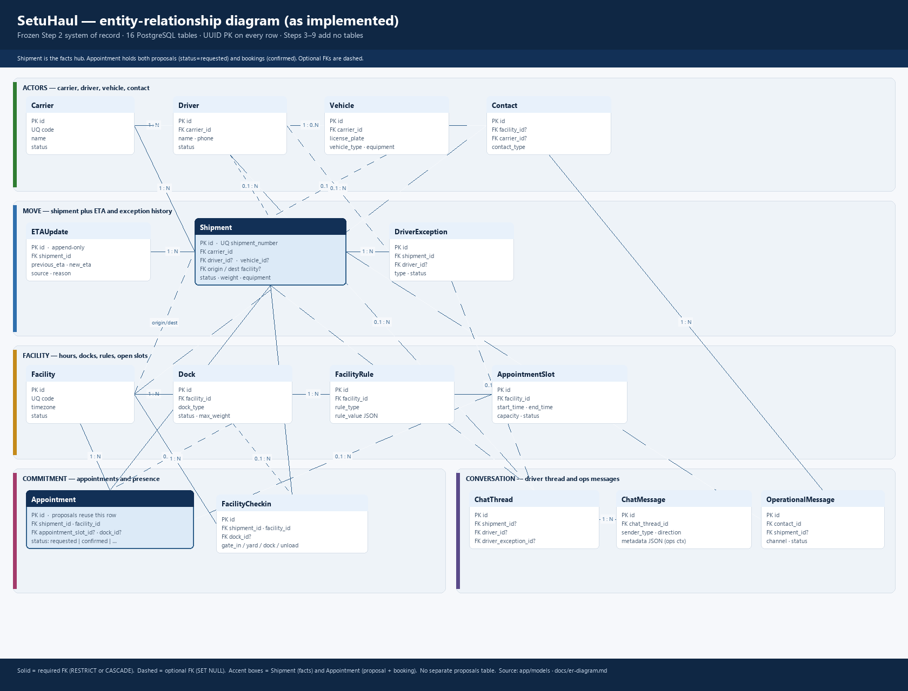
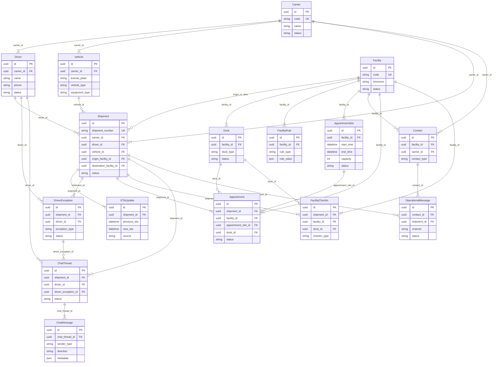

# SetuHaul entity-relationship diagram

Frozen Step 2 system of record in PostgreSQL (**16 SQLAlchemy tables**). UUID primary keys, `created_at` on every row. Steps 3–9 add no tables.

Rendered overview: [er_diagram.png](er_diagram.png). Source: `app/models`. Runtime and authority design: [architecture.md](architecture.md).

| | |
|---|---|
| Tables | 16 |
| Schema after Step 2 / 2H | Frozen |
| New tables in Steps 3–9 | 0 |
| Proposals + bookings | Same `Appointment` row |

## How later steps use this ER

Feasibility (Step 5) and ranking (Step 9) only read these rows. Allocation (Step 6) locks `appointment_slots` and `docks`, then writes `Appointment`. Step 7 proposals are `Appointment` rows with `status=requested` (capacity not consumed). Confirm re-runs Step 5, then Step 6, then `confirmed`. Conversation (Step 8) stores driver dialogue on `ChatThread` / `ChatMessage`; operational context lives in `ChatMessage.metadata` JSON.

## Logical clusters

| Cluster | Tables | Role in decisions |
|---|---|---|
| Actors | Carrier, Driver, Vehicle, Contact | Active-status and compatibility facts |
| Move | Shipment, ETAUpdate, DriverException | Identity, latest ETA from history, blocking exceptions |
| Facility | Facility, Dock, FacilityRule, AppointmentSlot | Hours, capacity, docks, open slots |
| Commitment | Appointment, FacilityCheckin | Holds, confirms, gate/yard/dock presence |
| Conversation | ChatThread, ChatMessage, OperationalMessage | Driver dialogue; ops context in metadata JSON |

Required FKs use `RESTRICT` or `CASCADE`. Optional FKs (`SET NULL`) are the `||--o{` edges: driver and vehicle on shipment, origin/dest facility, slot and dock on appointment/check-in, carrier/facility on contact, and all ChatThread foreign keys.

**Proposal reuse.** `Appointment.status = requested` is a hold that does not consume capacity. Confirm runs Step 5 again, then Step 6 under row locks, then `status = confirmed`. Rejected, expired (30 minutes from `created_at`, application TTL), and stale are terminal. There is no separate proposals table.

**Schema-bound gaps.** The current assignment model does not fully model shipment `priority`, `product_class`, `expected_unload_minutes`, vehicle length, or dock identity as a separately booked resource. No `expires_at` on holds. No human-task table — escalation is a flag on the chat thread. Appointment slots currently represent facility-level windows rather than individual dock-level resources.

## Foreign keys and delete rules

| Parent | Child | FK | Card. | On delete |
|---|---|---|---|---|
| Carrier | Driver | `carrier_id` | 1 : N | RESTRICT |
| Carrier | Vehicle | `carrier_id` | 1 : N | RESTRICT |
| Carrier | Shipment | `carrier_id` | 1 : N | RESTRICT |
| Carrier | Contact | `carrier_id` | 1 : 0..N | SET NULL |
| Driver | Shipment | `driver_id` | 0..1 : 0..N | SET NULL |
| Vehicle | Shipment | `vehicle_id` | 0..1 : 0..N | SET NULL |
| Facility | Shipment | `origin_facility_id` | 0..1 : 0..N | SET NULL |
| Facility | Shipment | `destination_facility_id` | 0..1 : 0..N | SET NULL |
| Shipment | ETAUpdate | `shipment_id` | 1 : N | CASCADE |
| Shipment | DriverException | `shipment_id` | 1 : N | CASCADE |
| Driver | DriverException | `driver_id` | 0..1 : 0..N | SET NULL |
| Facility | Dock | `facility_id` | 1 : N | CASCADE |
| Facility | FacilityRule | `facility_id` | 1 : N | CASCADE |
| Facility | AppointmentSlot | `facility_id` | 1 : N | CASCADE |
| Facility | Contact | `facility_id` | 1 : 0..N | SET NULL |
| Shipment | Appointment | `shipment_id` | 1 : N | CASCADE |
| Facility | Appointment | `facility_id` | 1 : N | RESTRICT |
| AppointmentSlot | Appointment | `appointment_slot_id` | 0..1 : 0..N | SET NULL |
| Dock | Appointment | `dock_id` | 0..1 : 0..N | SET NULL |
| Shipment | FacilityCheckin | `shipment_id` | 1 : N | CASCADE |
| Facility | FacilityCheckin | `facility_id` | 1 : N | RESTRICT |
| Dock | FacilityCheckin | `dock_id` | 0..1 : 0..N | SET NULL |
| Shipment | ChatThread | `shipment_id` | 0..1 : 0..N | SET NULL |
| Driver | ChatThread | `driver_id` | 0..1 : 0..N | SET NULL |
| DriverException | ChatThread | `driver_exception_id` | 0..1 : 0..N | SET NULL |
| ChatThread | ChatMessage | `chat_thread_id` | 1 : N | CASCADE |
| Contact | OperationalMessage | `contact_id` | 1 : N | CASCADE |
| Shipment | OperationalMessage | `shipment_id` | 0..1 : 0..N | SET NULL |

## Status vocabularies that drive decisions

| Column | Values |
|---|---|
| EntityStatus | active, inactive |
| ShipmentStatus | pending, assigned, in_transit, at_facility, delivered, cancelled |
| AppointmentStatus | requested, held, confirmed, rejected, cancelled, expired |
| AppointmentSlotStatus | open, full, closed |
| DockStatus | available, occupied, maintenance, inactive |
| ExceptionType / Status | traffic, breakdown, repair, delay, other / open, acknowledged, resolved |
| CheckinType | gate_in, yard_arrival, dock_arrival, unloading_complete |
| ChatThreadStatus | open, closed |
