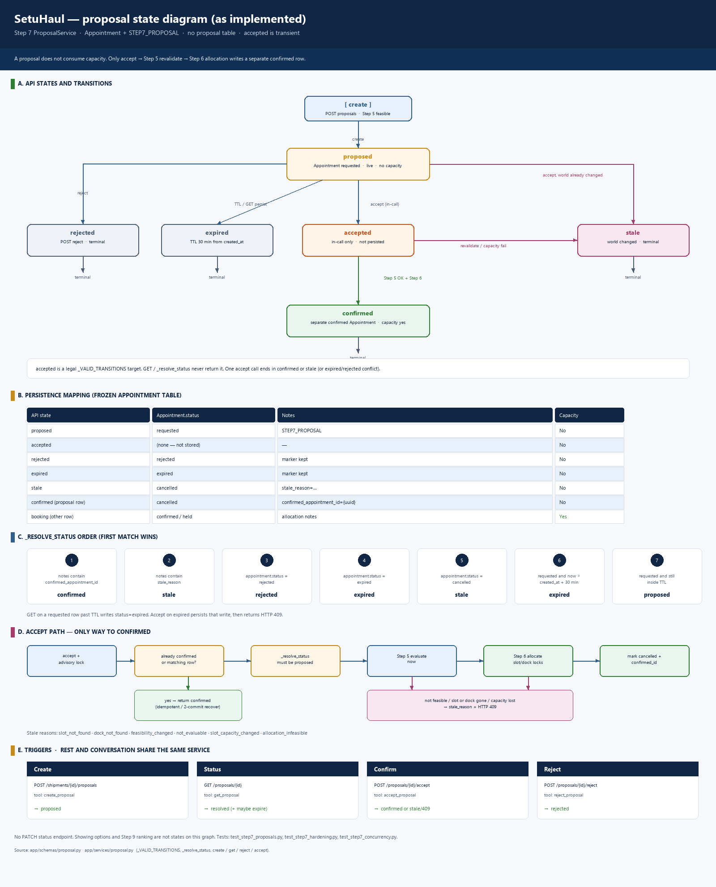
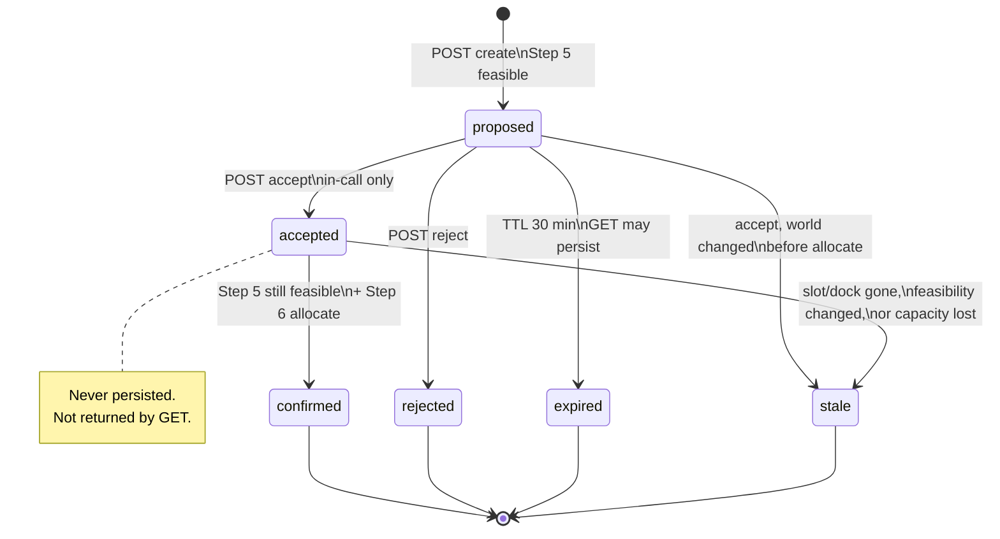
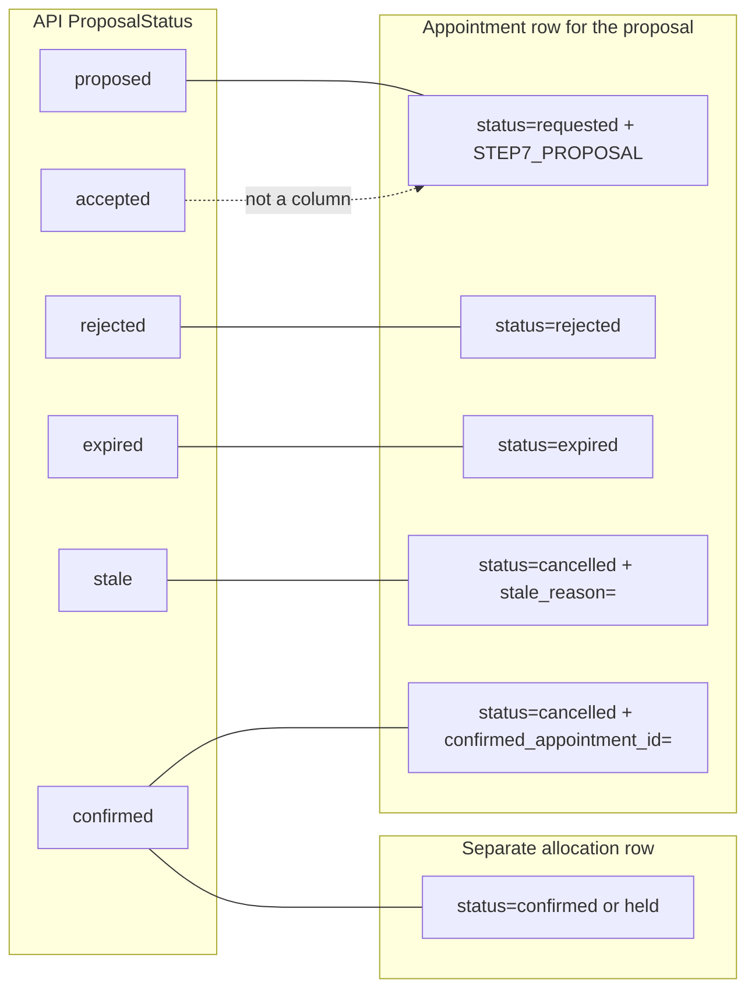
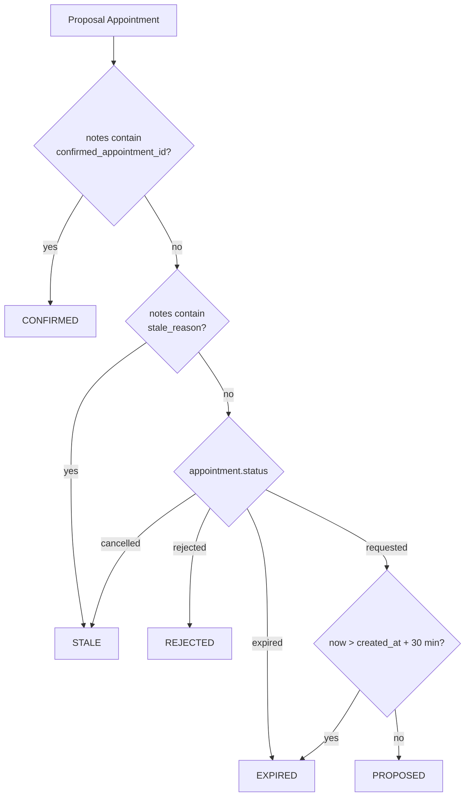
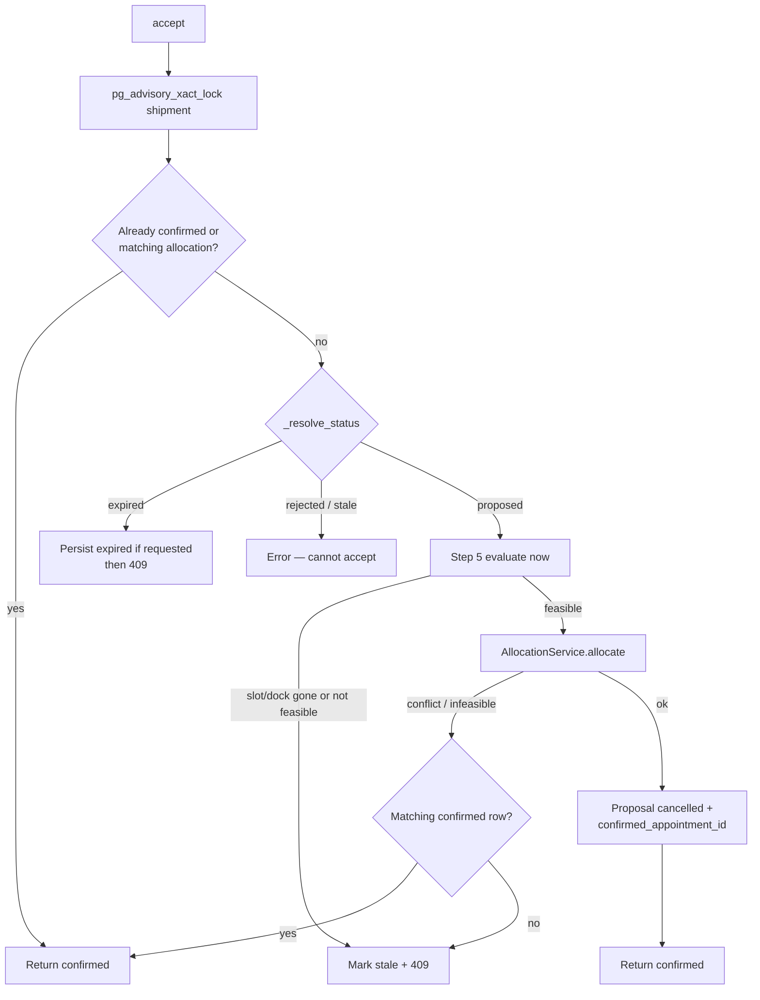

# SetuHaul proposal state diagram

API-facing `ProposalStatus` as implemented in Step 7 (`ProposalService`). Companion to [Show_Propose_Confirm_Sequence.md](Show_Propose_Confirm_Sequence.md), [Concurrency_locking_sequence.md](Concurrency_locking_sequence.md), and [architecture.md](architecture.md).

Rendered overview: [proposal_state_diagram.png](proposal_state_diagram.png).

**Rule.** A proposal is not a booking. It is an `Appointment` row with `status=requested` and `STEP7_PROPOSAL` in `notes`. Slot capacity is unchanged until `accept` re-runs Step 5 and Step 6 writes a **separate** `confirmed` row. There is no proposal table and no `expires_at` column.

## What is implemented

| Piece | Location | Role |
|---|---|---|
| API states | `ProposalStatus` in `app/schemas/proposal.py` | `proposed`, `accepted`, `rejected`, `expired`, `stale`, `confirmed` |
| Persistence | Frozen `Appointment` table | Marker `STEP7_PROPOSAL` in `notes`. No extra table. |
| Create | `ProposalService.create` | Step 5 must be feasible; write `requested`. Returns `proposed`. |
| Read | `ProposalService.get` | `_resolve_status`; may persist `expired` if TTL passed |
| Reject | `ProposalService.reject` | Only from `proposed`. Terminal. |
| Accept | `ProposalService.accept` | Advisory lock → revalidate Step 5 → allocate Step 6 |
| Legal graph | `_VALID_TRANSITIONS` | Rejected / expired / stale / confirmed have no outbound edges |
| TTL | `_compute_expires_at` | `created_at + 30 minutes`. Application-side. |
| REST | `app/api/proposals.py` | Create / get / accept / reject. No `PATCH` status endpoint. |
| Conversation | `create_proposal`, `accept_proposal`, `reject_proposal`, `get_proposal` | Same service. LLM cannot invent a state. |

Tests: `tests/test_step7_proposals.py`, `tests/test_step7_hardening.py`, `tests/test_step7_concurrency.py`.

## API states (as coded)

`accepted` is a **legal transition target** in `_VALID_TRANSITIONS`. It is **not** a stored appointment status and `_resolve_status` never returns it. One accept call either confirms, marks stale, or fails; it does not pause as `accepted`.

| API `ProposalStatus` | Live or terminal | How it appears | Capacity |
|---|---|---|---|
| `proposed` | Live | Open proposal | No |
| `accepted` | Transient (in accept only) | Never stored; never returned by GET | No |
| `rejected` | Terminal | Driver / REST reject | No |
| `expired` | Terminal | 30 minutes from `created_at` | No |
| `stale` | Terminal | World changed on accept, or cancelled without confirm notes | No |
| `confirmed` | Terminal | Matching allocation exists | **Yes — on the other row** |

## Persistence mapping (no proposal table)

Step 2 schema is frozen. `_resolve_status` maps appointment fields and `notes` lines onto `ProposalStatus`.

| Record | `Appointment.status` | Notes | Consumes slot capacity? |
|---|---|---|---|
| Open proposal | `requested` | `STEP7_PROPOSAL` | No |
| Rejected | `rejected` | marker kept | No |
| Expired | `expired` | marker kept | No |
| Stale | `cancelled` | `stale_reason=…` | No |
| Proposal after success | `cancelled` | `confirmed_appointment_id={uuid}` | No |
| Booking | `confirmed` (new row from Step 6) | allocation notes | Yes |

`AppointmentStatus.HELD` is counted as capacity-consuming for allocations. Proposals never sit in `held`.

## How `_resolve_status` decides

Order is coded, not inferred. First matching rule wins.

GET on an open row that has passed TTL writes `Appointment.status=expired` then returns `expired`. Accept on the same condition raises conflict after persisting `expired`.

## Legal transitions (`_VALID_TRANSITIONS`)

| From | Allowed to | Forbidden (examples) |
|---|---|---|
| `proposed` | `accepted`, `rejected`, `expired`, `stale` | Direct jump to `confirmed` without the accept path |
| `accepted` | `confirmed`, `stale` | Reject while still in the accept call |
| `rejected` | — | Accept, expire, revive |
| `expired` | — | Accept, reject |
| `stale` | — | Accept, reject |
| `confirmed` | — | Reject, re-propose the same row |

Idempotent reads after success: if `confirmed_appointment_id` is already in notes, or a matching `confirmed`/`held` allocation exists for the same shipment + slot (+ dock), accept returns `confirmed` without allocating again (two-commit recovery).

## Accept path (the only way to `confirmed`)

Implemented in `ProposalService.accept`. Conversation `accept_proposal` and `POST /proposals/{id}/accept` share this method.

Stale reasons written today: `slot_not_found`, `dock_not_found`, `feasibility_changed`, `not_evaluable`, `slot_capacity_changed`, `allocation_infeasible`.

## REST and conversation triggers

| Event | REST | Conversation tool | Resulting API state |
|---|---|---|---|
| Create after show | `POST /shipments/{id}/proposals` | `create_proposal` | `proposed` |
| Status | `GET /proposals/{id}` | `get_proposal` | Resolved status; may persist `expired` |
| Confirm | `POST /proposals/{id}/accept` | `accept_proposal` | `confirmed` or `stale` / expired conflict |
| Reject | `POST /proposals/{id}/reject` | `reject_proposal` | `rejected` |

There is no `PATCH /proposals/{id}` that sets status by hand. Showing options (`get_available_options`) does not create a proposal. Step 9 ranking does not write these states.

## What this diagram does not include

`AppointmentStatus.HELD` as a proposal state, a persisted `expires_at` column, driver authentication on accept/reject, and `POST /schedule/confirm`. Those are out of scope as built. Showing a numbered option in chat is not a state on this graph.
